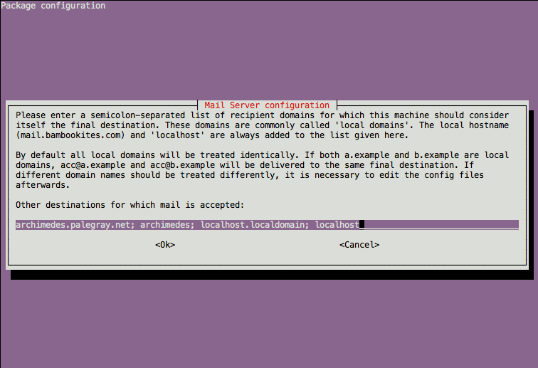

# ~~~~~~~~~~ DRAFT ~~~~~~~~~~
*[Pull Requests](https://github.com/DigitalOcean-User-Projects/Articles-and-Tutorials/pulls) gladly accepted*

Install a Send-only Mail Server for Your Apps on Ubuntu 12.04
====

### Introduction

Due to the popularity of Gmail, Google Apps, Outlook.com, Yahoo! Mail & a myriad of other providers, many cloud-server users mistakenly fail to install a mail server, initially. However, humans are not the only ones that send email. If fact, many Linux server applications also need to send email.

## Exim Message Transfer Agent (MTA)

Exim is a lightweight MTA developed at the University of Cambridge for use on Unix-based systems connected to the Internet. It is freely available under the terms of the [GNU General Public Licence](http://www.gnu.org/licenses/gpl.html). Today, Exim 4 is the default MTA on Debian Linux systems.

## Prerequisites

This guide assumes that you have already set your droplet's hostname and Fully Qualified Domain Name (FQDN). *See* [Setting the Hostname & Fully Qualified Domain Name (FQDN) on Ubuntu 12.04](https://github.com/DigitalOcean-User-Projects/Articles-and-Tutorials/blob/master/set_hostname_fqdn_on_ubuntu.md).

## Update Current Software

First, you want to update the software packages already on your server; by executing:

	sudo apt-get update && sudo apt-get -y upgrade && sudo apt-get -y dist-upgrade && sudo apt-get -y autoremove

## Installation

Then, to install Exim and its dependencies, execute: 

	sudo apt-get -y install exim4

## Configure Exim for Local Mail Service

To start the Exim configuration, execute:

	sudo dpkg-reconfigure exim4-config

and configure everything according to your needs.

#### Mail Server Configuration Type

The first configuration window you encounter will ask you to select the `mail server configuration type that best meets your needs.` If not already highlighted, use the arrow keys on your keyboard to select `internet site; mail is sent and received directly using SMTP`:

Next, tap the <code>Tab</code> key (to highlight <code>&lt;Ok&gt;</code>) and press <code>Enter</code>.

#### Enter FQDN

The next configuration window you'll encounter will ask that you enter your system's fully qualified domain name (FQDN) in the `mail name` configuration screen:

Next, tap the <code>Tab</code> key (to highlight <code>&lt;Ok&gt;</code>) and press <code>Enter</code>.

#### SMTP Listener

The ensuing configuration window will ask you to decide on which interfaces you would like `Exim` to "listen." Enter <code>127.0.0.1</code>, only:

**Note:** DigitalOcean anticipates IPv6 support in the near future; at which time, you will want to instruct `Exim` to listen on both <code>127.0.0.1; ::1</code>.

Next, tap the <code>Tab</code> key (to highlight <code>&lt;Ok&gt;</code>) and press <code>Enter</code>.

#### Mail Destinations

The configuration prompt that follows will ask that you enter all of the destinations for which `Exim` should accept mail. List your FQDN, local hostname, and <code>localhost</code>:

Next, tap the <code>Tab</code> key (to highlight <code>&lt;Ok&gt;</code>) and press <code>Enter</code>.

#### Relay Options

Advanced configurations beyond the scope of this article allow you to use `Exim` as a relay mail server. In the next screen, leave the `relay mail` field blank:

Tap the <code>Tab</code> key (to highlight <code>&lt;Ok&gt;</code>) and press <code>Enter</code>.

The subsequent screen is a follow-up to the relay mail server option. Leave this window blank and tap the <code>Tab</code> key (to highlight <code>&lt;Ok&gt;</code>) and press <code>Enter</code>.

#### DNS Queries

Select **No** when asked whether to keep DNS queries to a minimum:

Make sure that <code>&lt;No&gt;</code> is highlighted and press <code>Enter</code>.

#### Delivery Method

In the window that follows, choose whichever mail delivery method you'd like for incoming mail; although the <code>Maildir</code> format can make handling individual, locally-delivered mail messages easier:

Next, tap the <code>Tab</code> key (to highlight <code>&lt;Ok&gt;</code>) and press <code>Enter</code>.

#### Configuration File

In the ensuing prompt, choose the default `unsplit` configuration file, by selecting <code>No</code>:

Make sure that <code>&lt;No&gt;</code> is highlighted and press <code>Enter</code>.

#### Postmaster address

In the last configuration window, enter at least one external email address (choose one that you check frequently) in addition to root when asked to specify postmaster mail recipients.

## Test Your Mail Configuration

Issue the following command to send a test email, substituting an external email address for `someone@somedomain.tld`.

	echo "This is a test." | mail -s Testing someone@somedomain.told

## Additional Resources

*	[Documentation for Exim](http://www.exim.org/docs.html)

# ~~~~~~~~~~ DRAFT ~~~~~~~~~~
*[Pull Requests](https://github.com/DigitalOcean-User-Projects/Articles-and-Tutorials/pulls) gladly accepted* 