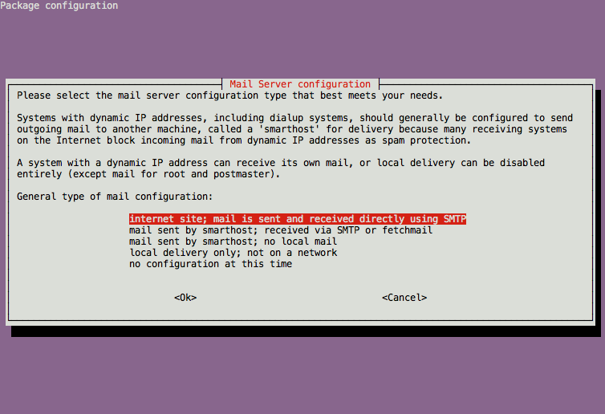

# ~~~~~~~~~~ DRAFT ~~~~~~~~~~
*[Pull Requests](https://github.com/DigitalOcean-User-Projects/Articles-and-Tutorials/pulls) gladly accepted*

Install a Send-only Mail Server on Ubuntu Server for Your Apps
====

### Introduction

Due to the popularity of Gmail, Google Apps, Outlook.com, Yahoo! Mail & a myriad of other providers, many cloud-server users mistakenly fail to install a mail server, initially. However, humans are not the only ones that send email. If fact, many Linux server applications also need to send email.

## Exim Message Transfer Agent (MTA)

Exim is a lightweight MTA developed at the University of Cambridge for use on Unix systems connected to the Internet. It is freely available under the terms of the [GNU General Public Licence](http://www.gnu.org/licenses/gpl.html). Today, Exim 4 is the default MTA on Debian GNU/Linux systems.

## Prerequisites

This guide assumes that you have already set your droplet's hostname and Fully Qualified Domain Name (FQDN). 

## Update Current Software

First, you want to update the software packages already on your server; by executing:

	sudo apt-get update && sudo apt-get -y upgrade && sudo apt-get -y dist-upgrade && sudo apt-get -y autoremove

## Installation

Then, to install Exim and its dependencies, execute: 

	sudo apt-get -y install exim4

## Configure Exim for Local Mail Service

To start the Exim configuration execute:

	sudo dpkg-reconfigure exim4-config

and configure everything according to your needs. The first configuration window will ask you to select the "mail server configuration type that best meets your needs." If not already highlighted, use the arrow keys to select `internet site; mail is sent and received directly using SMTP`.

Next, tap the `Tab` key (to highlight `<Ok>` and press `Enter`.

## Test Your Mail Configuration

Issue the following command to send a test email, substituting an external email address for `someone@somedomain.tld`.

	echo "This is a test." | mail -s Testing someone@somedomain.told

## Additional Resources

*	[Documentation for Exim](http://www.exim.org/docs.html)

# ~~~~~~~~~~ DRAFT ~~~~~~~~~~
*[Pull Requests](https://github.com/DigitalOcean-User-Projects/Articles-and-Tutorials/pulls) gladly accepted* 